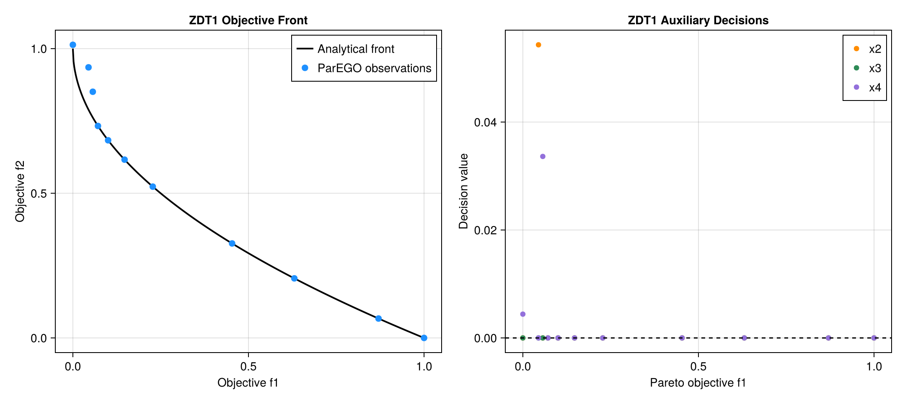

# AsyncMultiObjectiveBayesOpt.jl

[](https://github.com/Mojiajun2022/AsyncMultiObjectiveBayesOpt.jl/actions/workflows/ci.yml)
[](https://Mojiajun2022.github.io/AsyncMultiObjectiveBayesOpt.jl)
[](LICENSE)

Asynchronous MPI multi-objective Bayesian optimization for expensive Julia
black-box functions.

The package is designed for scientific simulations and model-fitting workflows
where evaluations take seconds to hours, finish at different times, and must
balance two or more competing objectives.



## Why this package

- **Actually asynchronous:** a worker receives a new point as soon as it
  finishes; there is no batch barrier.
- **Multi-objective by construction:** the final archive uses original
  objective vectors and Pareto dominance.
- **Scalable acquisition:** ParEGO handles two to several objectives without
  expensive high-dimensional hypervolume integration.
- **Pending-point awareness:** Kriging-believer fantasies discourage duplicate
  work across concurrent workers.
- **Practical surrogate:** exact normalized Gaussian processes, automatic
  length-scale selection, adaptive jitter, and Pareto-local candidates.
- **Cluster ready:** runs with MPI.jl on a workstation or under Slurm.
- **Easy to debug:** the same API falls back to serial execution with one rank.

## Installation

```julia
using Pkg
Pkg.add(url="https://github.com/Mojiajun2022/AsyncMultiObjectiveBayesOpt.jl")
```

For a checkout:

```bash
git clone https://github.com/Mojiajun2022/AsyncMultiObjectiveBayesOpt.jl
cd AsyncMultiObjectiveBayesOpt.jl
julia --project=. -e 'using Pkg; Pkg.instantiate(); Pkg.test()'
```

## Quick start

```julia
using AsyncMultiObjectiveBayesOpt

objective(x) = [x[1]^2, (x[1] - 2.0)^2]

result = async_mobo(
    objective,
    reshape([-5.0, 5.0], 1, 2);
    n_objectives=2,
    objective_senses=[:min, :min],
    max_evals=80,
    n_initial=12,
    candidate_pool=5_000,
    seed=2026,
)

println(result.pareto_X)
println(result.pareto_Y)
```

The objective must return a vector with exactly `n_objectives` finite values.
Columns in `pareto_X` and `pareto_Y` correspond to one another.

## MPI execution

Install the launcher once:

```bash
julia --project=. -e 'using MPI; MPI.install_mpiexecjl()'
```

Run one scheduler with eight workers:

```bash
OMP_NUM_THREADS=1 OPENBLAS_NUM_THREADS=1 JULIA_NUM_THREADS=1 \
$HOME/.julia/bin/mpiexecjl -n 9 \
  julia --project=. examples/expensive_simulation_mpi.jl
```

Every rank calls `async_mobo`; only rank zero receives the result.

## Algorithm

Each proposal uses an augmented Tchebycheff scalarization with a changing
objective weight. Periodic near-extreme weights improve coverage of front
endpoints, while Dirichlet weights explore intermediate trade-offs.

For each scalarization, the optimizer:

1. normalizes finite objective observations;
2. fits an exact RBF Gaussian process;
3. selects a length scale by marginal likelihood;
4. adds posterior-mean fantasies for pending points;
5. evaluates expected improvement over global and Pareto-local candidates;
6. dispatches the best non-duplicate point.

Scalarization is used only for acquisition. The returned archive is computed
from the original objective vectors.

## Benchmark accuracy

All included benchmarks have analytical Pareto fronts. IGD is normalized
inverted generational distance; lower is better.

| Problem | Dimensions | Budget | ParEGO IGD | Random IGD |
|---|---:|---:|---:|---:|
| Schaffer N.1 | 1 | 80 | 0.032060 | 0.050024 |
| Convex bi-objective | 2 | 100 | 0.044516 | 0.062199 |
| ZDT1 | 4 | 180 | 0.054313 | 0.408050 |


For ZDT1, the returned front covered the full analytical `f1` range `[0, 1]`.
The three decision variables that must converge to zero had observed mean
`0.002798`.

Reproduce the results:

```bash
julia --project=. benchmark/run_benchmarks.jl
```

## Result fields

| Field | Meaning |
|---|---|
| `pareto_X` | Nondominated parameter vectors, one per column |
| `pareto_Y` | Corresponding original objective vectors |
| `pareto_indices` | Pareto columns in the complete history |
| `compromise_x`, `compromise_y` | Front point nearest the normalized ideal |
| `X_history`, `Y_history` | All completed evaluations in completion order |
| `evaluation_seconds` | Runtime of each objective evaluation |
| `elapsed_seconds` | Total optimizer wall time |
| `n_evaluations`, `n_failures` | Completed and failed evaluations |
| `worker_count` | Number of evaluation workers |
| `hypervolume_2d` | Two-objective dominated hypervolume |

The compromise point is a convenience selection, not a unique mathematical
optimum.

## Documentation and examples

- [Full documentation](https://Mojiajun2022.github.io/AsyncMultiObjectiveBayesOpt.jl)
- [Step-by-step tutorial](docs/src/tutorial.md)
- [MPI and cluster guide](docs/src/mpi.md)
- [Benchmark methodology](docs/src/benchmarks.md)
- [Three-objective example](examples/three_objectives_mpi.jl)
- [Expensive simulation template](examples/expensive_simulation_mpi.jl)

## Scope and limitations

The current implementation targets continuous box-bounded problems with
hundreds to low thousands of expensive evaluations. Exact GP fitting grows
cubically with completed samples. The package does not yet provide nonlinear
constraints, categorical parameters, checkpoint/restart, correlated
multi-output GPs, or sparse surrogates.

## License

MIT
