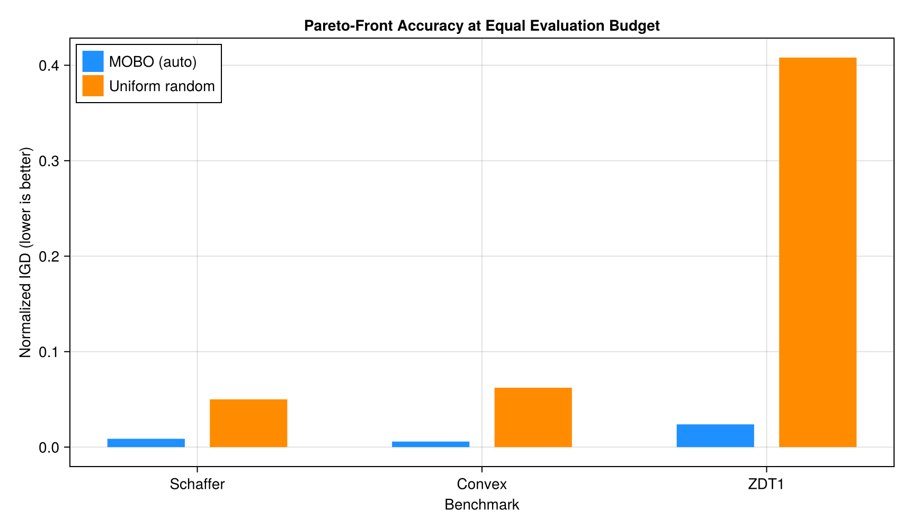
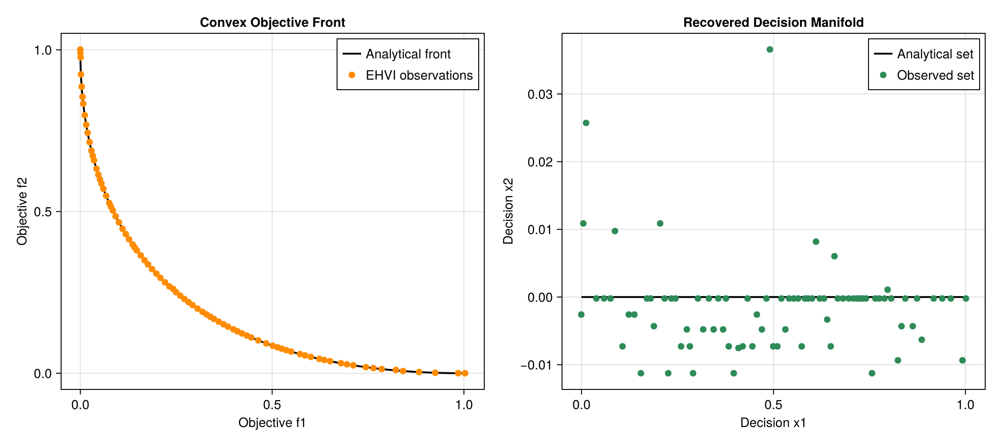

# Benchmarks

The benchmark suite uses problems with analytical Pareto fronts:

- Schaffer N.1;
- a convex two-parameter, two-objective problem;
- four-dimensional ZDT1.

Run all benchmarks:

```bash
julia --project=. benchmark/run_benchmarks.jl
```

Run a subset:

```bash
julia --project=. benchmark/run_benchmarks.jl schaffer zdt1
```

## Observed accuracy

Normalized inverted generational distance (IGD) is lower when the observed
front more closely covers the analytical front.



| Problem | Budget | MOBO (`:auto`) IGD | Random IGD |
|---|---:|---:|---:|
| Schaffer N.1 | 80 | 0.008708 | 0.050024 |
| Convex bi-objective | 100 | 0.005802 | 0.062199 |
| ZDT1 (4D) | 180 | 0.023823 | 0.408050 |



For ZDT1, the two-objective EHVI acquisition and ARD kernel reduced IGD by
about 56% relative to the original ParEGO-only implementation. With a
240-evaluation high-accuracy configuration, IGD reached `0.022147` and all
three auxiliary decision variables were exactly zero on the returned front.

Generate every documentation figure from fresh optimization runs:

```bash
julia --project=benchmark -e '
  using Pkg
  Pkg.develop(path=pwd())
  include("benchmark/generate_plots.jl")'
```
