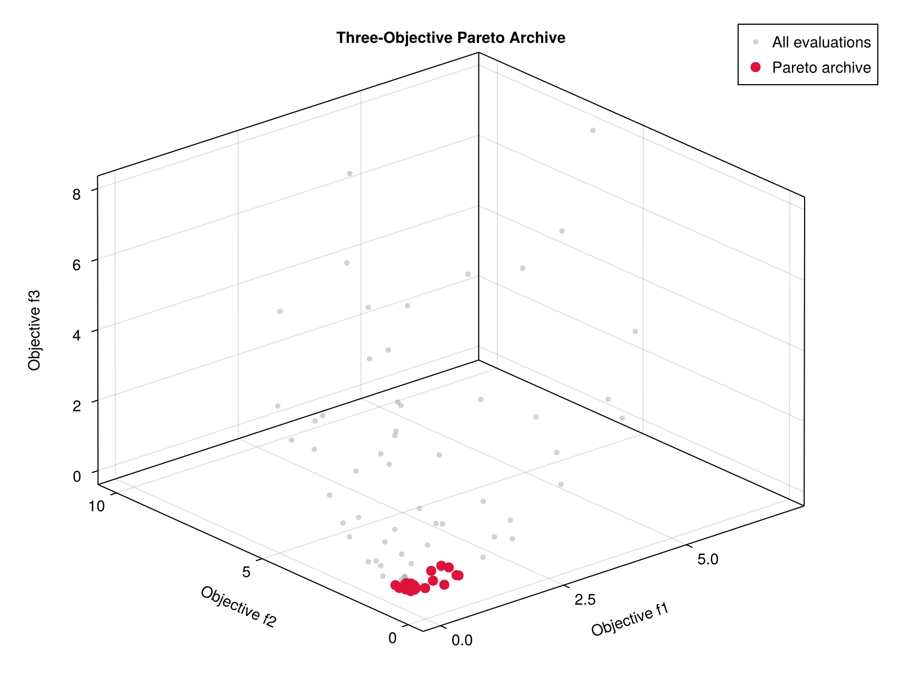

# Examples

All examples are executable from the repository root.

## Schaffer N.1

```bash
julia --project=. examples/schaffer_serial.jl
```

This one-dimensional problem has a continuous analytical Pareto set and is the
quickest way to inspect the API.

## ZDT1

```bash
julia --project=. examples/zdt1_serial.jl
```

ZDT1 tests whether the optimizer can discover the hidden decision manifold
`x2=x3=x4=0` while covering a nonlinear objective front.


## Mixed objective directions

```bash
julia --project=. examples/mixed_senses_serial.jl
```

This example minimizes cost while maximizing quality.

## Three objectives under MPI

```bash
$HOME/.julia/bin/mpiexecjl -n 5 \
  julia --project=. examples/three_objectives_mpi.jl
```



## Expensive simulation template

```bash
$HOME/.julia/bin/mpiexecjl -n 9 \
  julia --project=. examples/expensive_simulation_mpi.jl
```

The template creates a worker-specific directory, evaluates one simulation,
and extracts three objective values from its output.
