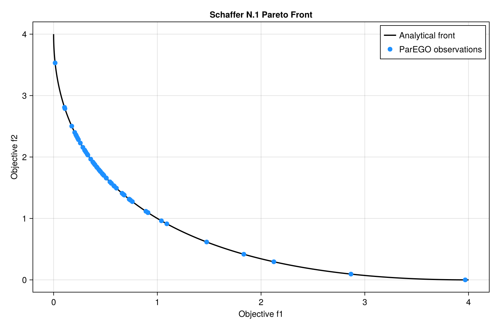

# Tutorial

## 1. Define a vector-valued objective

The objective accepts one parameter vector and returns a fixed-length vector.
This example minimizes two competing quadratic objectives:

```julia
using AsyncMultiObjectiveBayesOpt

objective(x) = [x[1]^2, (x[1] - 2.0)^2]
bounds = reshape([-5.0, 5.0], 1, 2)
```

The first objective is minimized at `x=0`, while the second is minimized at
`x=2`. Every `x` in `[0, 2]` is Pareto-optimal.

## 2. Run the optimizer

```julia
result = async_mobo(
    objective,
    bounds;
    n_objectives=2,
    objective_senses=[:min, :min],
    max_evals=80,
    n_initial=12,
    candidate_pool=5_000,
    seed=2026,
)
```

This command runs serially when launched with one Julia process. The same code
runs asynchronously when launched under MPI.



## 3. Inspect the Pareto archive

```julia
result.pareto_X
result.pareto_Y
result.pareto_indices
```

Columns correspond across these arrays. `pareto_X[:, j]` produced the objective
vector `pareto_Y[:, j]`.

There is no unique best point on a Pareto front. For convenience, the result
also contains:

```julia
result.compromise_x
result.compromise_y
```

This is the observed Pareto point nearest the normalized ideal point. It is a
neutral inspection choice, not a replacement for domain-specific preferences.

## 4. Mixed minimization and maximization

Use one direction per objective:

```julia
result = async_mobo(
    cost_and_quality,
    bounds;
    n_objectives=2,
    objective_senses=[:min, :max],
    max_evals=100,
)
```

The returned objective values retain their original signs and units.

## 5. Choose an evaluation budget

Useful starting points for expensive deterministic objectives are:

| Parameter dimensions | Initial design | Total budget | Candidate pool |
|---:|---:|---:|---:|
| 1-3 | 12-20 | 80-150 | 5,000-8,000 |
| 4-8 | 20-40 | 150-400 | 8,000-20,000 |
| 9-15 | 40-80 | 300-1,000 | 20,000-50,000 |

These are starting points, not guarantees. More objectives, noise, disconnected
fronts, and broad parameter bounds require larger budgets.

## 6. Connect an expensive simulation

Run the expensive simulation once and derive every objective from the same
output:

```julia
function objective(parameters)
    simulation = run_simulation(parameters)
    return [
        fit_error_dataset_a(simulation),
        fit_error_dataset_b(simulation),
        fit_error_dataset_c(simulation),
    ]
end
```

If the simulation throws or any returned objective is non-finite, that entire
evaluation is recorded as a failure. The optimizer continues with the remaining
finite evaluations.

## 7. Save results

Only rank zero receives the result. A dependency-free CSV writer can use
`DelimitedFiles`:

```julia
using DelimitedFiles
using MPI

if MPI.Comm_rank(MPI.COMM_WORLD) == 0
    writedlm("pareto_parameters.csv", permutedims(result.pareto_X), ',')
    writedlm("pareto_objectives.csv", permutedims(result.pareto_Y), ',')
    writedlm("all_parameters.csv", permutedims(result.X_history), ',')
    writedlm("all_objectives.csv", permutedims(result.Y_history), ',')
end
```

For long cluster jobs, save the completed result immediately after
`async_mobo` returns.
